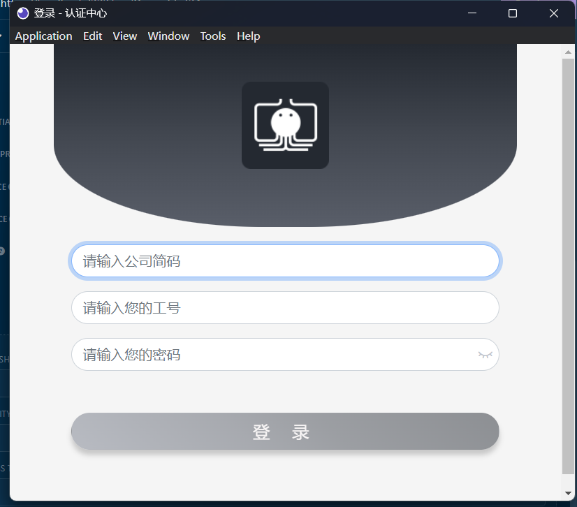
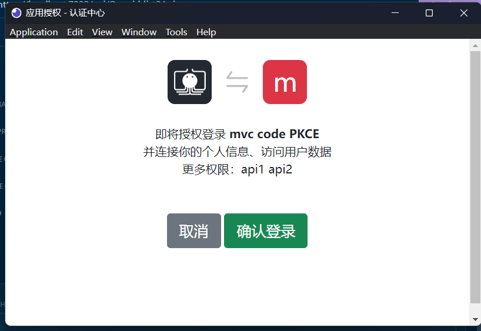

## 关于OeniddictProvider
+ 实现了多租户版本的Oauth2 及 OpenId Connect Server
 >支持 code flow(PKCE)/password flow/clientCredentials flow/refresh flow  
+ 核心授权数据单独存储，各用户(租户下)的数据分开存储 
+ 登录页面，授权页面，退出页面重新设计，适配移动端浏览器   
+ 引用的技术 
>.net6 
>openiddict/
>sqlite3/
>finbuck.multitentant.efcore 等  
+ 可直接运行

## 效果图

## 演示

